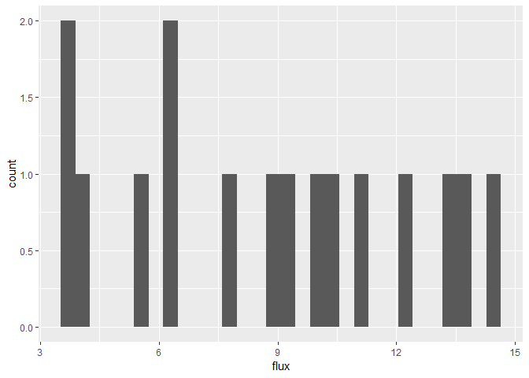
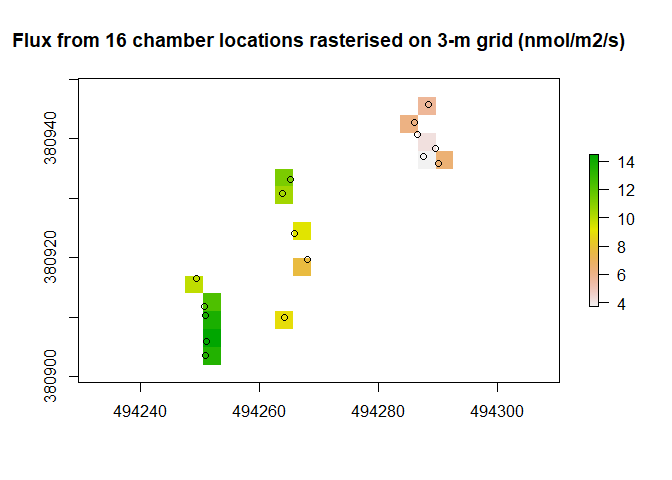
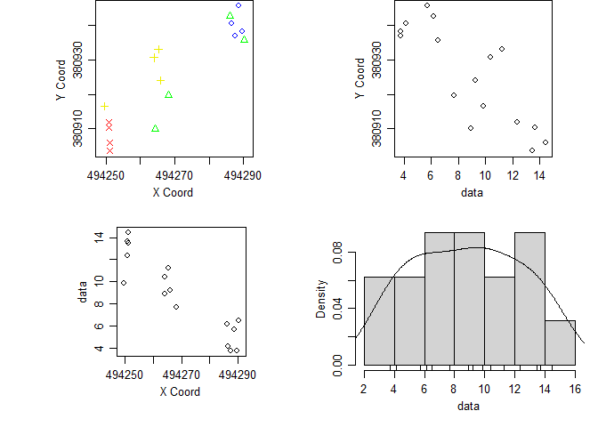
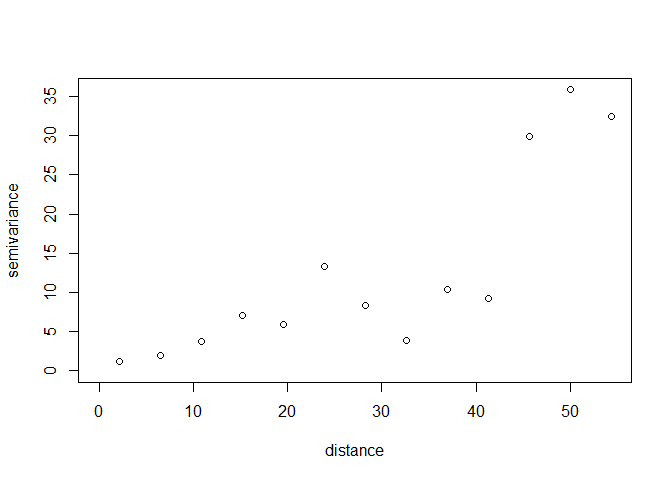
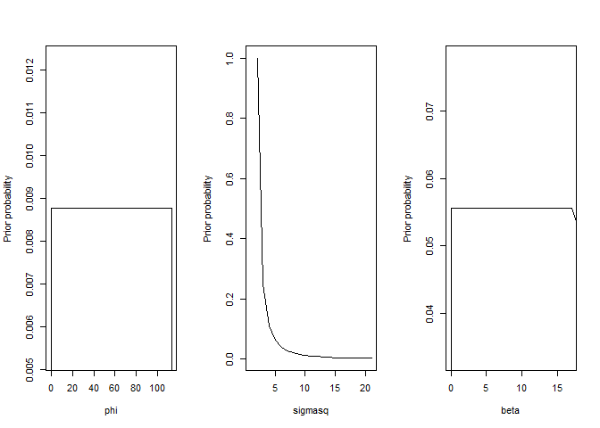
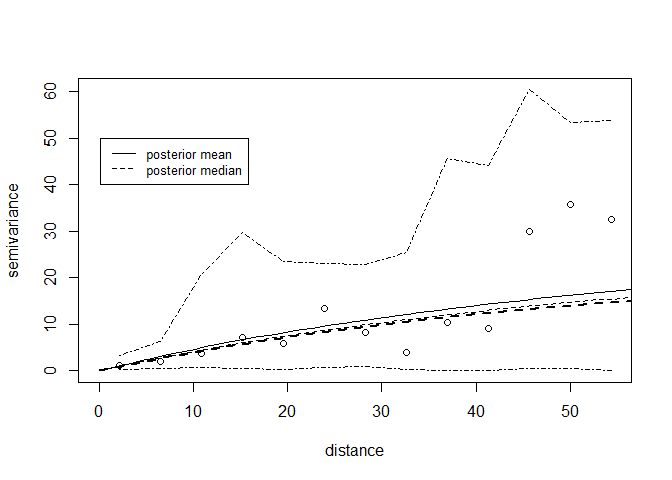
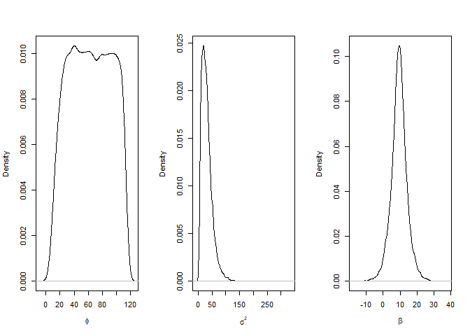
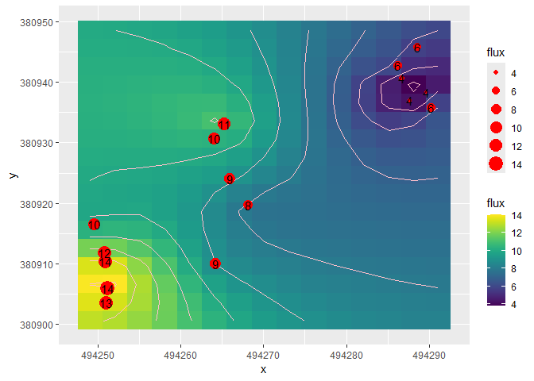
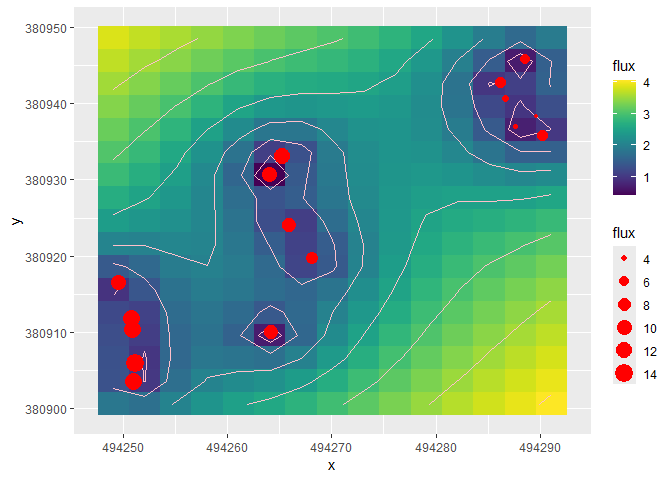
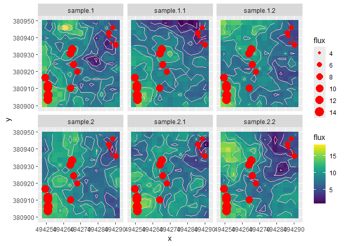

## Background
This document describes a probabilistic geostatistical approach, Bayesian Kriging, for addressing the issue of upscaling chamber flux measurements to larger domains (e.g. whole fields or farms).  The approach is related to Ordinary Kriging, in that it is a method for interpolating between data points, based on the observed spatial covariance structure, commonly shown graphically as a (semi-)variogram.  However, in the Bayesian form, rather than estimating the parameters of the variogram by ordinary least-squares, we represent them as probability distributions, and update them using the data and Bayes Theorem via Monte Carlo Markov Chain (MCMC) methods.  The advantage of this approach is that it makes spatial predictions, based on the observed chamber flux data, but accounts explicitly for the uncertainty in the spatial pattern across the domain. Where the area sampled is small compared to the domain of interest (typically \textless 1\% in the case of GHG measurements in agricultural fields), this is a major source of uncertainty which is generally ignored.

## How the code works
In brief, the chamber flux data are interpolated over a prediction grid using the krige.bayes function in the geoR package.  The uncertainty in this mean is given by the variability in the mean across all the simulations produced by krige.bayes.
Functions are contained in the file `source(here::here("R/flux-bayes-kriging.R"))`.
A more thorough description of the background and terminology is given [here](https://nerc-ceh.github.io/beem/ae/ae-09-spatial.html).

## Packages required
The code is written in the R language. The following R packages are used for graphics and spatial analysis.


```r
here::i_am("vignettes/flux-bayes-kriging.Rmd")
```

```
## here() starts at C:/Users/plevy/Documents/flux-bayes-kriging
```

```r
# install.packages(c("here", "ggplot2", "raster", "geoR", "viridis")) # if not already installed
library(here)
library(ggplot2)
library(raster)
library(geoR)
library(viridis)
source(here::here("R/flux-bayes-kriging.R"))
set.seed(586)
```

## Defining the prediction grid

A rectangular grid is defined for predictions, typically the extent of a field. The resolution (cell size) can be made coarser or finer, at the cost of compuation time.  We use the GB Ordnance Survey grid reference system (EPSG:27700) as the coordinate reference system (crs), though no reprojection is needed here.


```r
######### Set up prediction grid. #############
# Define size and location of grid:
# extentField <- extent(494100, 494350, 380750, 381050)
extentField <- extent(494247.6, 494291.6, 380900.1, 380950.1)
# Smaller resolution = higher computation time
res <- 3 # resolution for prediction grid, m
# Define the coordinate rotation system (crs) for the grid
crs_OSGB <- raster::crs("EPSG:27700")  # a terra crs object

# define a raster object with the above extent, resolution and crs
r <- raster(extentField, resolution = res, crs = crs_OSGB)
```

## Chamber flux data
We read in some example data from a CSV file, and plot the histogram of the fluxes.


```r
df <- read.csv(file = here::here("data/df_flux_sim.csv"))
names(df)
```

```
## [1] "easting"  "northing" "flux"
```

```r
summary(df)
```

```
##     easting          northing           flux       
##  Min.   :494250   Min.   :380904   Min.   : 3.716  
##  1st Qu.:494251   1st Qu.:380911   1st Qu.: 6.050  
##  Median :494266   Median :380927   Median : 9.083  
##  Mean   :494269   Mean   :380925   Mean   : 8.828  
##  3rd Qu.:494287   3rd Qu.:380937   3rd Qu.:11.525  
##  Max.   :494290   Max.   :380946   Max.   :14.464
```

```r
head(df)
```

```
##    easting northing     flux
## 1 494288.5 380945.8 5.706829
## 2 494289.6 380938.4 3.715965
## 3 494290.2 380935.8 6.482770
## 4 494286.1 380942.8 6.164824
## 5 494286.6 380940.7 4.152216
## 6 494287.6 380937.0 3.750604
```


```r
ggplot(df, aes(x = flux)) + geom_histogram(bins = 30)
```

<!-- -->

We can rasterise the data and plot them on the prediction grid.


```r
r_obs <- raster::rasterize(x = df[, 1:2], r, field = df[, 3])
plot(r_obs)
points(df[, 1:2])
title(main = "Flux from 16 chamber locations rasterised on 3-m grid (nmol/m2/s)")
```

<!-- -->

For working in `geoR`, the data need to be converted to a "geodata" object, specifying which columns contain the coordinates and the  flux data values. Additional covariates could be included in the data, but are not used here. The data are then summarised and plotted.


```r
gdf <- as.geodata(df, coords.col = 1:2, data.col = 3)
summary(gdf)
```

```
## Number of data points: 16 
## 
## Coordinates summary
##      easting northing
## min 494249.5 380903.6
## max 494290.2 380945.8
## 
## Distance summary
##       min       max 
##  1.432524 56.511901 
## 
## Data summary
##      Min.   1st Qu.    Median      Mean   3rd Qu.      Max. 
##  3.715965  6.050326  9.082858  8.827798 11.525343 14.464413
```

```r
plot(gdf)
```

<!-- -->

We can plot a basic empirical variogram from the data.

```r
vgm <- variog(gdf)
```

```
## variog: computing omnidirectional variogram
```

```r
plot(vgm)
```

<!-- -->

As expected, variance increases with distance, but the variogram is not smooth, and the range is not clear. There is no clear asymptote, but there are fewer pairs of points with large distances, so these points receive less weight, and the variogram is less reliable at large distances.

## Prior distributions for the variogram model parameters
For a Bayesian analysis, we need to specify the prior distributions for the parameters of the variogram model.  Here we use a uniform prior for the range ($\phi$) and mean ($\beta$), and a reciprocal prior for the sill ($\sigma^2$).  This means that all values of $\phi$ and $\beta$ within the specified range are equally probable, whereas large values of $\sigma^2$ become increasingly improbable, in proportion to their reciprocal. The prior distributions are plotted below. The intercept of "nugget" ($\tau$) is assumed to be zero, but can be estimated as well. Alternative values and assumptions can be specified by changing the  code within `krige.bayes`.

<!-- -->


## Bayesian Kriging
The `krige.bayes` function is wrapped inside the `interpolate_flux` function, and requires three arguments:

- `df` is the data frame containing the chamber flux data
- `r` is the raster object defining the prediction grid
- `n_posterior` is the number of posterior samples to draw from the MCMC chain.  The default is 1000, but 10000 is recommended for a more accurate estimate of the posterior distribution.


```r
system.time(bsp <- interpolate_flux(df, r, n_posterior = 10000))
```

```
## variog: computing omnidirectional variogram
```

```
##    user  system elapsed 
##    0.62    0.03    1.97
```

We can now examine the estmated variogram model with its approximate bounds.


```r
par(mfrow = c(1, 1))
vgm_lfit <- likfit(gdf, ini = c(0.5, 0.5), fix.nugget = FALSE, messages = FALSE)
vgm <- variog(gdf)
```

```
## variog: computing omnidirectional variogram
```

```r
vgm_env <- variog.model.env(gdf, obj.v = vgm,
                             model.pars = vgm_lfit)
```

```
## variog.env: generating 99 simulations (with  16 points each) using the function grf
## variog.env: adding the mean or trend
## variog.env: computing the empirical variogram for the 99 simulations
## variog.env: computing the envelops
```

```r
plot(vgm, env = vgm_env)
lines(bsp, summary.posterior = mean)
lines(bsp, summ = median, lty = 2)
lines(bsp, summ = "mode", post = "par", lwd = 2, lty = 2)
legend(0.15, 50, legend = c("posterior mean",
  "posterior median"), lty = c(1, 2), lwd = c(1, 1), cex = 0.8)
```

<!-- -->

The joint posterior distributions of the variogram model parameters are shown below. The mean values of the parameters are also displayed.


```r
par(mfrow = c(1, 3))
plot(density(bsp$posterior$sample$phi), main = "", xlab = expression(phi))
plot(density(bsp$posterior$sample$sigmasq), main = "", xlab = expression(sigma^2))
plot(density(bsp$posterior$sample$beta), main = "", xlab = expression(beta))
```

<!-- -->

```r
colMeans(bsp$posterior$sample)
```

```
##      beta   sigmasq       phi tausq.rel 
##  9.396988 31.437710 63.084700  0.000000
```


## Predictions and uncertainty
The mean of the predicted fluxes are plotted below. The mean is the average of the posterior samples, and gives the best (most probable) single prediction we can make.


```r
plot_mean_prediction(bsp, r, df)
```

<!-- -->

The standard deviation of the posterior samples (below) is the appropriate measure of uncertainty in the predictions. This is lowest in areas where there are more data points and highest where there are fewer data points or where the data are more variable.


```r
plot_sigma_prediction(bsp, r, df)
```

<!-- -->

As well as these summary variables, we can plot individual realisations of the flux field, to give an idea of the range of possible spatial patterns consistent with the data. Here we show six examples, but typically thousands are generated in the posterior sampling.


```r
plot_realisations(bsp, r, df, n_realisations = 6)
```

<!-- -->

